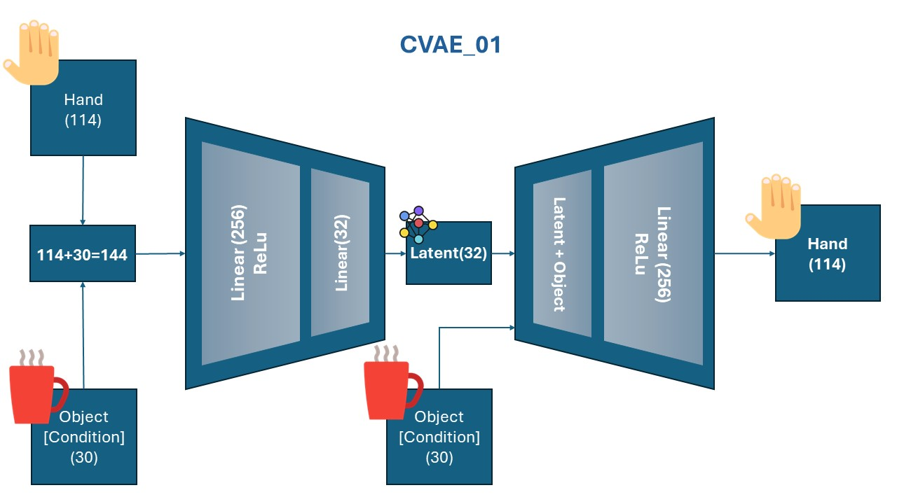
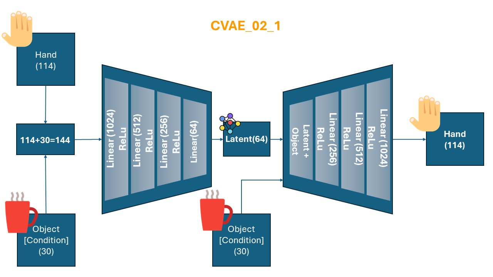
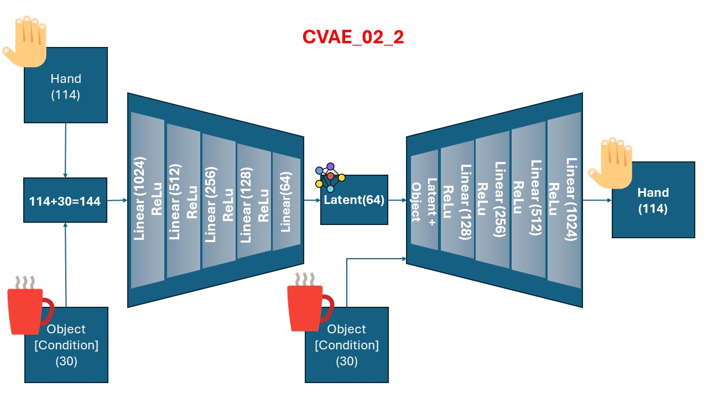

# Grasp Pose Generation: Engineering Generative Models to Synthesize Human Hand Actions Based on Object Affordances for Robots

[](https://www.python.org/downloads/)
[](https://pytorch.org/)
[](https://opensource.org/licenses/MIT)

A research project that develops **Conditional Variational Autoencoders (CVAE)** to autonomously generate human-like hand poses for robotic systems based on object affordances. This work enables robots to perform dynamic, flexible, and autonomous object manipulation tasks without explicit programming.

## 📋 Table of Contents

- [Overview](#overview)
- [Key Features](#key-features)
- [Installation](#installation)
- [Quick Start](#quick-start)
- [Project Structure](#project-structure)
- [Model Architectures](#model-architectures)
- [Dataset](#dataset)
- [Usage](#usage)
- [Results](#results)
- [Documentation](#documentation)
- [Citation](#citation)
- [Contributing](#contributing)
- [License](#license)

## 🎯 Overview

This project was developed as part of an **MSc in Artificial Intelligence** at **Sheffield Hallam University**, where it received a **distinction** grade. The dissertation addresses the challenge of enabling robots to perform human-like hand actions by learning from object affordances. Traditional robotic systems require explicit programming for each object and task, limiting their adaptability. This work presents a generative approach using CVAE models that can:

- **Autonomously generate hand poses** based on object information
- **Learn from 3D hand-object interactions** in the HO-3D_v3 dataset
- **Generalize across different objects** without task-specific programming
- **Enable dynamic robotic behaviors** for human-robot interaction and autonomous manipulation

The research demonstrates that generative models can effectively capture the relationship between object affordances and hand configurations, enabling more natural and adaptive robotic manipulation.

📄 **Full Dissertation Report**: For detailed methodology, experimental results, and analysis, see the [complete dissertation report](docs/myDissertationReport.pdf).

## ✨ Key Features

- **Multiple CVAE Architectures**: Six different model variants (CVAE_01 through CVAE_02_3) with varying complexities
- **Comprehensive Data Pipeline**: Complete data extraction, preprocessing, and loading utilities
- **Robust Training Framework**: Flexible training scripts with configurable hyperparameters
- **Evaluation Metrics**: Built-in metrics for model performance assessment
- **Visualization Tools**: 3D visualization of hand-object interactions
- **Standard Python Package**: Properly structured, installable package following best practices

## 🚀 Installation

### Prerequisites

- Python 3.8 or higher
- CUDA-capable GPU (recommended for training)

### Step 1: Clone the Repository

```bash
git clone https://github.com/Siavash-Mortaz/Grasp_Pose_Generation.git
cd Grasp_Pose_Generation
```

### Step 2: Install Dependencies

```bash
pip install -r requirements.txt
```

### Step 3: Install Package (Development Mode)

```bash
pip install -e .
```

## 🏃 Quick Start

### Training a Model

```bash
python scripts/train.py --model cvae_02_3 --epochs 50 --batch_size 64 --latent_dim 32
```

### Evaluating a Model

```bash
python scripts/evaluate.py \
    --model cvae_02_3 \
    --checkpoint models/checkpoints/cvae_02_3_weights.pth \
    --data_path data/hand_object_data.pkl
```

### Using the Package

```python
from grasp_pose_generation.models import CVAE_02_3
from grasp_pose_generation.training import loading_data
from grasp_pose_generation.evaluation import mean_squared_error, mean_absolute_error

# Load preprocessed data
hand_train, hand_val, hand_test, obj_train, obj_val, obj_test, \
    train_dataset, val_dataset, test_dataset, train_loader, val_loader, test_loader, obj_names = \
    loading_data('data/hand_object_data.pkl', batch_size=64)

# Initialize model
model = CVAE_02_3(input_dim=114, latent_dim=32, condition_dim=30)

# Train and evaluate...
```

## 📁 Project Structure

```
grasp_pose_generation/
├── src/
│   └── grasp_pose_generation/      # Main package
│       ├── models/                 # CVAE model definitions
│       ├── data/                   # Data extraction and preprocessing
│       ├── training/               # Training utilities and data loaders
│       ├── evaluation/             # Evaluation metrics
│       └── visualization/          # Visualization utilities
├── scripts/                        # Executable scripts
│   ├── train.py                   # Training script
│   └── evaluate.py                # Evaluation script
├── models/
│   └── checkpoints/               # Saved model weights (.pth files)
├── data/                          # Data files
│   └── raw/                       # Raw dataset files
├── outputs/                       # Outputs
│   ├── plots/                     # Generated plots and visualizations
│   └── logs/                      # Training logs and metrics
├── tests/                         # Unit tests
├── docs/                          # Documentation
├── images/                        # Images and diagrams for documentation
├── requirements.txt               # Python dependencies
├── setup.py                       # Package setup
└── pyproject.toml                 # Modern Python packaging config
```

## 🏗️ Model Architectures

The project implements six CVAE variants, each with different architectural choices:

### CVAE_01
- **Architecture**: 3 layers (encoder/decoder)
- **Features**: 2 linear layers + 1 ReLU layer per encoder/decoder
- **Use Case**: Baseline model

### CVAE_02
- **Architecture**: 5 layers (encoder/decoder)
- **Features**: 3 linear layers + 2 ReLU layers per encoder/decoder
- **Performance**: Best initial performance among baseline models

### CVAE_03
- **Architecture**: 9 layers (encoder/decoder)
- **Features**: Batch normalization + Dropout layers for regularization
- **Use Case**: Regularization experiments

### CVAE_02_1
- **Architecture**: 7 layers (encoder/decoder)
- **Features**: Extended version of CVAE_02 with additional layers
- **Performance**: Similar to CVAE_02

### CVAE_02_2
- **Architecture**: 9 layers (encoder/decoder)
- **Features**: Further extended architecture
- **Performance**: Slight improvement over CVAE_02_1

### CVAE_02_3 ⭐ (Recommended)
- **Architecture**: 9 layers (encoder/decoder)
- **Features**: Conditional input removed from encoder (only in decoder)
- **Performance**: Final optimized model with simplified architecture
- **Use Case**: Production-ready model

### Architecture Diagrams








## 📊 Dataset

This project uses the **HO-3D_v3** dataset, a comprehensive dataset for 3D hand-object pose annotation.

### Dataset Details

- **Total Images**: 103,462 RGB images
- **Annotations**: 3D hand-object poses + depth maps
- **Subjects**: 10 human subjects (3 females, 7 males)
- **Objects**: 10 objects from the YCB dataset
- **Hand Model**: MANO model for hand pose estimation

### Citation

```bibtex
@INPROCEEDINGS{hampali2020honnotate,
    title={HOnnotate: A method for 3D Annotation of Hand and Object Poses},
    author={Shreyas Hampali and Mahdi Rad and Markus Oberweger and Vincent Lepetit},
    booktitle={CVPR},
    year={2020}
}
```

### Dataset Access

The dataset is available at: [HO-3D Dataset](https://1drv.ms/f/s!AsG9HA3ULXQRlFy5tCZXahAe3bEV?e=BevrKO)

### Data Preprocessing

The data preprocessing pipeline includes:

1. **Extraction**: Extract hand poses and object information from HO-3D_v3 dataset
2. **Normalization**: StandardScaler normalization for all features
3. **Splitting**: 60:20:20 train/validation/test split
4. **Feature Combination**: Hand pose (48D) + translation (3D) + joints (63D) = 114D
5. **Object Features**: Translation (3D) + rotation (3D) + corners (24D) = 30D


## 💻 Usage

### Data Preprocessing

```python
from grasp_pose_generation.data import load_ho3d_best_info, preprocess_data

# Extract data from HO-3D dataset
hand_poses, object_infos = load_ho3d_best_info(data_dir='path/to/ho3d', split='train')

# Preprocess and save
hand_data, obj_data, obj_names, scalers = preprocess_data(hand_poses, object_infos)
```

### Training

```bash
# Basic training
python scripts/train.py --model cvae_02_3 --epochs 50

# Advanced training with custom parameters
python scripts/train.py \
    --model cvae_02_3 \
    --epochs 100 \
    --batch_size 128 \
    --latent_dim 64 \
    --lr 0.0001 \
    --data_path data/hand_object_data.pkl \
    --output_dir models/checkpoints
```

### Evaluation

```bash
python scripts/evaluate.py \
    --model cvae_02_3 \
    --checkpoint models/checkpoints/cvae_02_3_weights.pth \
    --data_path data/hand_object_data.pkl \
    --batch_size 64 \
    --latent_dim 32
```

### Visualization

```python
from grasp_pose_generation.visualization.vis_hand_3D import plot_hand_3d
from grasp_pose_generation.visualization.vis_object_3D import load_xyz, apply_transformations

# Visualize hand pose in 3D
plot_hand_3d(hand_joints, hand_trans, hand_pose, obj_name)

# For object visualization, use the scripts in outputs/plots/ or 
# refer to the visualization module for custom implementations
```

## 📈 Results

### Model Performance

- **CVAE_02** demonstrated the best performance among initial models
- **CVAE_02_3** achieved optimal balance between complexity and performance
- Models successfully generate human-like hand poses from object information
- Validation on YCB dataset objects shows good generalization

### Key Findings

1. **Architecture Simplification**: Removing conditional input from encoder (CVAE_02_3) maintained performance while reducing complexity
2. **Generalization**: Models generalize well across different objects from the YCB dataset
3. **Latent Space**: Increasing latent dimension from 32 to 64 improved reconstruction accuracy
4. **Regularization**: Dropout and batch normalization (CVAE_03) showed minimal impact on performance

### Training Metrics

All training metrics (losses, errors) are saved in `outputs/logs/` as pickle files:
- Training loss
- Validation loss
- Reconstruction error
- Hand pose error
- Hand joints error
- Hand translation error

### Visualization Results

The models successfully generate human-like hand poses based on object affordances. Below are example visualizations of the generated hand-object interactions:


## 📚 Documentation

### Dissertation Report

The complete dissertation report with detailed methodology, experimental setup, results, and analysis is available:

📄 [Download Dissertation Report (PDF)](docs/myDissertationReport.pdf)

## 📚 Citation

If you use this code or reference this work, please cite:

```bibtex
@misc{grasp_pose_generation,
    title={Grasp Pose Generation: Engineering Generative Models to Synthesize Human Hand Actions Based on Object Affordances for Robots},
    author={Siavash Mortaz Hejri},
    year={2024},
    howpublished={\url{https://github.com/Siavash-Mortaz/Grasp_Pose_Generation}}
}
```

## 🤝 Contributing

Contributions are welcome! Please feel free to submit a Pull Request. For major changes, please open an issue first to discuss what you would like to change.

1. Fork the repository
2. Create your feature branch (`git checkout -b feature/AmazingFeature`)
3. Commit your changes (`git commit -m 'Add some AmazingFeature'`)
4. Push to the branch (`git push origin feature/AmazingFeature`)
5. Open a Pull Request

## 🧪 Testing

Run the test suite:

```bash
# Install test dependencies
pip install -e ".[dev]"

# Run all tests
pytest

# Run with coverage
pytest --cov=src/grasp_pose_generation --cov-report=html
```

## 📝 License

This project is licensed under the MIT License - see the LICENSE file for details.

## 🙏 Acknowledgments

- **Supervisors**: I would like to thank Dr. Alejandro Jiménez Rodríguez and Dr. Hamed Pourfannan for their guidance and supervision during this research at Sheffield Hallam University.
- **HO-3D Dataset**: Hampali et al. for providing the comprehensive hand-object interaction dataset
- **MANO Model**: For hand pose representation
- **YCB Dataset**: For object models used in validation

## 📧 Contact

For questions or inquiries, please open an issue on GitHub or contact [Siavash.Mortaz.Hejri@gmail.com](mailto:Siavash.Mortaz.Hejri@gmail.com).

---

**Note**: This is a research project. For production use, additional testing and validation are recommended.
